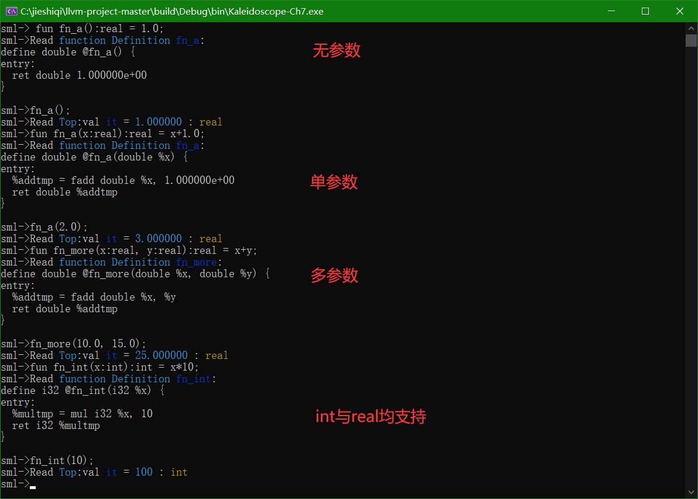
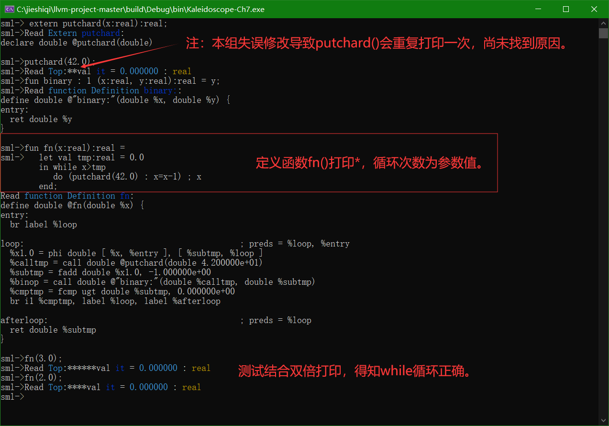

# Standard ML (llvm)
Course:	Interpreter construction experiment
Author:	Lu Guangfeng
	

#### Struct：

```
注：符号	⊕	表示我们添加的内容或者进行了修改
	:	表示解释
	-->	表示修改内容

程序结构,本实验分为词法分析，语法分析，中间代码生成和JIT修改四个部分：
	* Lexer: 词法分析部分
		** IdentifierStr: 写入保存字符变量/符号变量名
		** NumVal: 写入保存整型与浮点型变量的值
⊕		** enum Token: Token表
			--> 增删了一些token

⊕		** isSymbol(): 判断当前ASCII字符是否在ML语言符号变量范围内
⊕		** static int gettok(): 返回标准输入流中下一个Token
			--> 变化较大，增删了一些token的支持
			--> 改变了一些旧有token的识别方法

	* AST: 抽象语法树
		** ExprAST: 所有表达式节点的父类
⊕		** NumberExprAST:
			-->用来同时存入int型与real型变量的值
		** VariableExprAST:
		** UnaryExprAST:
		** BinaryExprAST:
		** CallExprAST:
		** IfExprAST:
⊕		** WhileExprAST:While循环节点类
⊕		** LetExprAST:Let结构循环类
		** PrototypeAST:
⊕		** FunctionAST:
			-->添加了getName()方法直接获取函数名，方便JIT交互
⊕		** ValAST:Val变量定义类

	* Parser: 语法分析
		** GetTokPrecedence()： 返回Token优先级
⊕		** LogError(): 报错处理
			-->修改输出内容为高亮红色
		
⊕		** ParseNumberExpr()
			-->修改添加了对变量类型的判断
		** ParseParenExpr()
		** ParseIdentifierExpr()
		** ParseIfExpr()
⊕		** ParseWhileExpr()
			--> whileexpr ::= 'while' exprssion 'do' expression ';' expression
⊕		** ParseLetExpr()
			--> letexpr ::= 'let' 'val' identifier : type  ('=' expression)? (';' 'val' identifier : type ('=' expression)?)* 'in' expression 'end'
⊕		** ParsePrimary()
			--> 有修改，增加对while的判别，删除对for的判别
		** ParseUnary()
		** ParseBinOpRHS()
		** ParseExpression()
⊕		** ParsePrototype()
			--> prototype ::= id '(' (id ':' type ',')* ')' ':' type '='
			--> extern的声明不需要“=”
			--> type为“real”或"int"
			--> 增加无参数情况
⊕		** ParseDefinition()
			--> definition ::= 'fun' prototype expression
		** ParseTopLevelExpr()
		** ParseExtern()
⊕		** ParseValExpr()
			--> valExpr ::= 'val' identifier ':' type = Expression
			--> type为“real”或"int"

	* CodeGen: 中间代码生成
		** NamedValues_Global: 全局变量
			--> static std::map<std::string, Value *> NamedValues_Global;
		** 其余略

		** getFunction()
⊕		** CreateEntryBlockAlloca()
			--> 新增对type的判断以返回不同变量类型
⊕		** NumberExprAST::codegen()
			--> 新增对type的判断以返回不同值类型
		** VariableExprAST::codegen()
		** UnaryExprAST::codegen()
⊕		** BinaryExprAST::codegen()
			--> 新增对左右侧类型的判断，当一侧为double时转double
			--> 新增了对整型的支持
		** CallExprAST::codegen()
		** IfExprAST::codegen()
⊕		** WhileExprAST::codegen()
			--> 在万花筒for循环基础上改的
⊕		** LetExprAST::codegen()
			--> 在万花筒var基础上改的
⊕		** PrototypeAST::codegen()
			--> 添加了对参数和返回值类型的判断，以返回不同变量类型
			--> 添加无参数情况的判断
⊕		** FunctionAST::codegen(Type **TypeToReturn)
			--> 参数Type **TypeToReturn是为了记录返回类型
	
⊕	* Top-Level & JIT
		** InitializeModuleAndPassManager()
⊕		** HandleDefinition()
			--> 添加了白能量type
			--> 添加了高亮输出
⊕		** HandleExtern()
			--> 添加了高亮输出
⊕		** HandleVal()：处理变量定义，有高亮输出
⊕		** HandleTopLevelExpression()
			--> 添加了对返回类型的判别以获取值
			--> 添加了高亮输出
⊕		** MainLoop()
			--> 添加了tok_val的判别

⊕	* "Library" functions
		** putchard()
		** printd()
	
⊕	* Main driver
		** main()
```

#### Result：

* 基本算术运算与比较运算：


*  函数定义与调用：



* 函数内定义局部变量


* IF 控制


* WHILE 循环：



* 异常报错：


* 缺陷

  + if 的条件和 then，else 的返回的值的类型必须一致，如果不一致会报错。
    错误提示：All operands to PHI node must be the same type as the PHI node!

  + 实现的 Standard ML 结构比较单一，没有数组，元组，树等高级的功能。

  + 添加颜色高亮时，可能修改了什么地方，导致函数 putchard()会重复打
    印一次。

  